# UJLP Complete Visual Changelog

This is a visual and historical changelog for the UJLP website from the first commit on `main` through the current `main` head.

Generated from local `main` at `383c3acf` on the 2026-09-12 commit history. The review used a temporary clone, checked out historical `main` source points, ran each version locally, and captured full-page desktop screenshots with headless Chromium.

## Method

- Source of truth: `main`.
- Pre-release cadence: one representative snapshot per active month before `v1.0.0`.
- Release cadence: every tagged release from `v1.0.0` forward.
- Current state: latest `main` after `v3.0.0`.
- Screenshot viewport: 1440 x 1100, full page.
- Screenshot storage: `docs/changelog-assets/history-screenshots/`.
- Quiet months: no `main` commits were found for November 2024 or March 2025.

### Tag note

Most release tags resolve cleanly to source commits on `main`. `v1.0.0` is the exception: its tag points to a deployment artifact on `gh-pages`, while the closest `main` source point had unresolved component imports in the current case-sensitive build environment. For `v1.0.0`, the timeline still uses the nearest `main` source commit for history, but the screenshot uses the actual static release artifact from the tag.

## Milestones At A Glance

| Milestone | Date | Source commit | Scope | Files | Diff |
| --- | --- | --- | ---: | ---: | --- |
| September 2024 | 2024-09-14 | `11aac1e9` | 16 commits | 28 | 19,350 insertions |
| October 2024 | 2024-10-13 | `f0cc119b` | 3 commits | 14 | 123 insertions, 125 deletions |
| December 2024 | 2024-12-31 | `52753057` | 11 commits | 15 | 130 insertions, 121 deletions |
| January 2025 | 2025-01-23 | `10427288` | 8 commits | 5 | 51 insertions, 79 deletions |
| February 2025 | 2025-02-27 | `322bca82` | 9 commits | 13 | 295 insertions, 155 deletions |
| April 2025 | 2025-04-13 | `1a73f0ad` | 6 commits | 21 | 744 insertions, 514 deletions |
| May 2025 | 2025-05-06 | `75c22525` | 1 commit | 1 | 36 insertions, 13 deletions |
| June 2025 | 2025-06-28 | `7f2574e2` | 4 commits | 16 | 2,788 insertions, 491 deletions |
| `v1.0.0` | 2025-07-19 | `d2c9b697` | 12 commits | 21 | 1,570 insertions, 121 deletions |
| `v1.1.0` | 2025-07-19 | `88eb78b2` | 6 commits | 11 | 1,452 insertions, 54 deletions |
| `v1.2.0` | 2025-08-02 | `04dd0a4a` | 9 commits | 7 | 158 insertions, 74 deletions |
| `v1.3.0` | 2025-08-03 | `bbd857b7` | 3 commits | 14 | 251 insertions, 42 deletions |
| `v1.3.1` | 2025-08-03 | `84cbb204` | 1 commit | 1 | 2 insertions, 3 deletions |
| `v1.4.0` | 2025-08-06 | `e6057b37` | 2 commits | 11 | 271 insertions, 91 deletions |
| `v1.5.0` | 2025-08-17 | `2922ea5f` | 14 commits | 36 | 480 insertions, 145 deletions |
| `v1.5.5` | 2025-08-23 | `5fbed82d` | 2 commits | 5 | 192 insertions, 6 deletions |
| `v1.5.6` | 2025-08-24 | `153ad673` | 4 commits | 58 | 89 insertions, 107 deletions |
| `v1.6.0` | 2025-09-01 | `52189c62` | 2 commits | 6 | 10 insertions, 18 deletions |
| `v1.7.0` | 2025-09-06 | `70b0e47f` | 3 commits | 11 | 118 insertions, 41 deletions |
| `v1.7.5` | 2025-09-06 | `73c9b352` | 1 commit | 3 | 91 insertions, 7 deletions |
| `v1.7.6` | 2025-09-06 | `8732424e` | 2 commits | 1 | 4 insertions, 4 deletions |
| `v1.8.0` | 2026-01-11 | `bca3c27e` | 6 commits | 27 | 1,203 insertions, 87 deletions |
| `v1.9.0` | 2026-01-15 | `cb44232c` | 5 commits | 13 | 147 insertions, 75 deletions |
| `v2.0.0` | 2026-01-17 | `75fc2c5e` | 4 commits | 31 | 2,511 insertions, 87 deletions |
| `V2.1.0` | 2026-05-08 | `3fbda74f` | 9 commits | 96 | 370 insertions, 1,333 deletions |
| `v3.0.0` | 2026-07-24 | `b8fd9706` | 35 commits | 57 | 4,065 insertions, 790 deletions |
| Current `main` | 2026-09-12 | `383c3acf` | 15 commits | 44 | 1,836 insertions, 1,017 deletions |

## Pre-Release History

### September 2024 - Foundation

- Anchor: `11aac1e9`, committed 2024-09-14.
- Scope: 16 commits, 28 changed files, 19,350 insertions.
- The repo began as a Create React App under `my-app`.
- The first public shape included a simple header, logo area, nav buttons, and a text-first journal description.
- Early work focused on making pages dynamic enough to navigate between home, about, journal, announcements, and contact surfaces.
- Contact functionality, Instagram/form references, the journal page, and logo treatment were already part of the first iteration.
- Representative commits: `531c8414` Start, `4dc21368` Dynamic, `714b4a8f` Instagram and Form are fixed, `541eee3a` Journal Page Fix, `12afb4f8` Fixed all of the logo stuff.

### October 2024 - Domain And Identity Cleanup

- Anchor: `f0cc119b`, committed 2024-10-13.
- Scope: 3 commits, 14 changed files, 123 insertions, 125 deletions.
- This month tightened the site identity after the first prototype.
- The title and logo were adjusted, and domain-name compatibility entered the codebase.
- A short reversion in the middle of the month suggests the site was being tuned visually and operationally rather than expanded into major new pages.
- Representative commits: `4ae46f26` Whole bunch of stuff, `30d2b949` reversion, `f0cc119b` Logo and title fixing alongside new domain name compatability.

### December 2024 - CSS Modularization And Mobile Repairs

- Anchor: `52753057`, committed 2024-12-31.
- Scope: 11 commits, 15 changed files, 130 insertions, 121 deletions.
- The code moved toward modular styling, with repeated commits around CSS structure.
- Spacing and phone rendering received sustained attention, indicating the prototype was being made usable outside a desktop-only viewport.
- Instagram linking was repaired.
- The content layer expanded with a new announcement.
- Representative commits: `70f08a51` Styling Changes for Modularization, `162beda7` Took care of all of the egregious spacing issues, `d37efa21` Fixed the Phone Version?, `3f6a518a` Fixing instagram link, `52753057` New Announcement.

### January 2025 - README And Announcement Pass

- Anchor: `10427288`, committed 2025-01-23.
- Scope: 8 commits, 5 changed files, 51 insertions, 79 deletions.
- The project README appeared in the history.
- The site received another announcement update.
- Several "Slight Changes" commits suggest cleanup and content tuning rather than a major structural redesign.
- Representative commits: `ad487082` Pushed Readme, `9bb45b99` Made a new announcement, `13822fed` Made a new announcement, `10427288` Slight Changes.

### February 2025 - Page Content And Mobile Tuning

- Anchor: `322bca82`, committed 2025-02-27.
- Scope: 9 commits, 13 changed files, 295 insertions, 155 deletions.
- Rob's name was added to the site.
- Contact, announcements, and journal pages were all updated.
- The home and about pages received both desktop and mobile updates.
- The final February snapshot shows a site moving from placeholder presence toward organization-wide informational pages.
- Representative commits: `2cdd71f5` Added Rob's name to site, `55688952` contact us update, `d614edf2` Announcements Update, `814b104b` Journal Update, `0754bf5e` Updated the Home and About Pages for mobile versions.

### April 2025 - First Major Site Overhaul

- Anchor: `1a73f0ad`, committed 2025-04-13.
- Scope: 6 commits, 21 changed files, 744 insertions, 514 deletions.
- The executive team expanded with Ruichong/Richard.
- A broader "Website Overhaul" landed, changing visual presentation and page structure.
- Phone styling and profile images became first-class work items.
- Shelby's image was added and image centering was refined.
- Representative commits: `f499a55b` Added Ruichong to the exec team, `dd6ec744` Website Overhaul, `002d3fd9` Phone Styling and Images Added, `7d41e397` Added Shelby's Image, `1a73f0ad` Centered The Images.

### May 2025 - Focused Update

- Anchor: `75c22525`, committed 2025-05-06.
- Scope: 1 commit, 1 changed file, 36 insertions, 13 deletions.
- This was a small maintenance month compared with April and June.
- The single "New Updates" commit adjusted existing content or styling without broad file churn.
- Representative commit: `75c22525` New Updates.

### June 2025 - Total Site Redesign

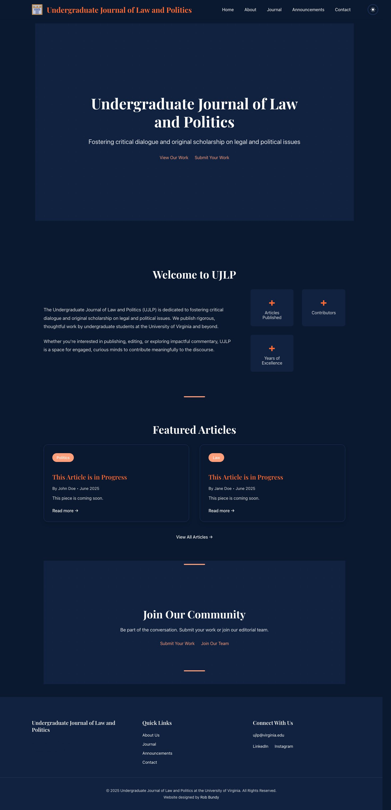

- Anchor: `7f2574e2`, committed 2025-06-28.
- Scope: 4 commits, 16 changed files, 2,788 insertions, 491 deletions.
- A major redesign landed under `51cad108`.
- The month centered on redesigning the entire site and then repairing mobile behavior.
- The visual direction became darker, more card-based, and closer to the first release line.
- Representative commits: `51cad108` Total Site Redesign, `a71436a8` Mobile Fixes for CSS, `78bb7e95` Fixed Mobile, `7f2574e2` Mobile Fixes.

## Release History

### `v1.0.0` - First Release

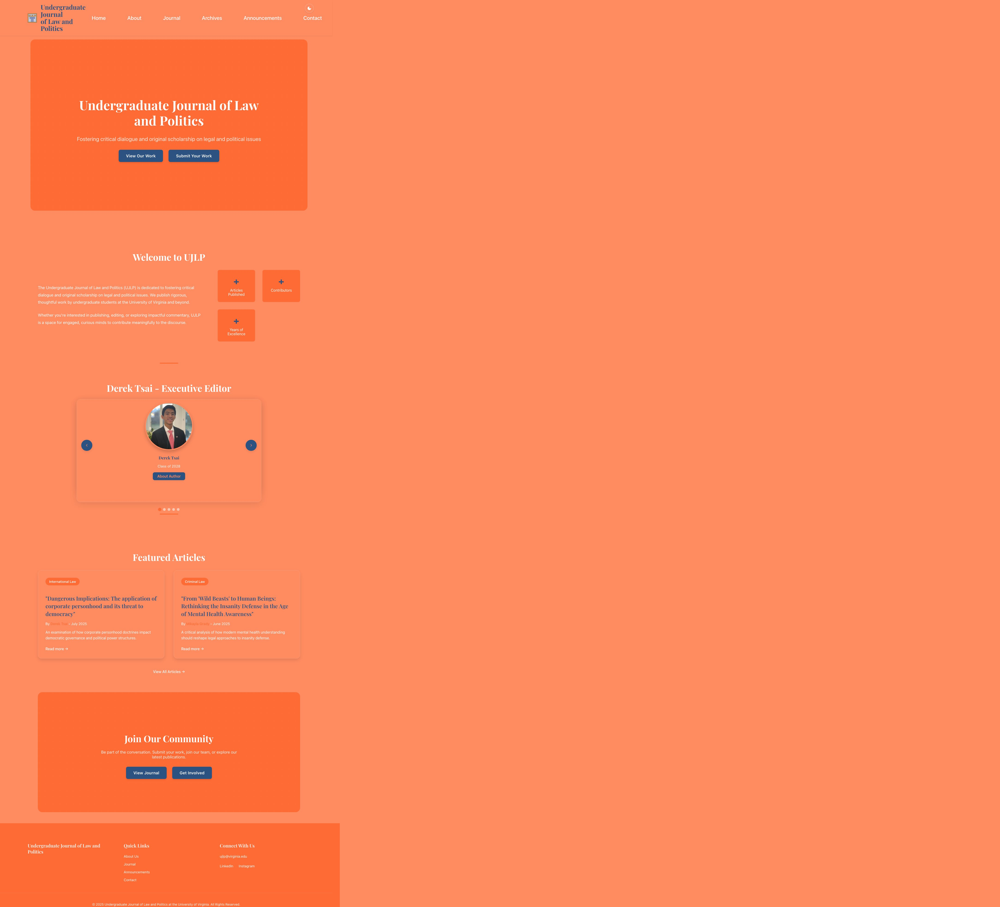

- Release date: 2025-07-19.
- Source anchor on `main`: `d2c9b697`.
- Screenshot source: static deployment artifact from the `v1.0.0` tag.
- Scope since June snapshot: 12 commits, 21 changed files, 1,570 insertions, 121 deletions.
- This release consolidated the June redesign into a release-ready public site.
- New member setup, mobile debugging, article preparation, author bio work, and a broader refactor all landed before the release.
- The visual result included a stronger home page, contributor carousel, featured article cards, and a more complete footer/community flow.
- Representative commits: `c12b05e5` New members setup and stylistic debugging for mobile, `ec0396d1` new article prep with author bios, `6770d8fc` big refactor, `1a3763da` Large phone image refactor, `ce748502` Button refactor and styling fix; 1.0?.

### `v1.1.0` - Timeline And Team Polish

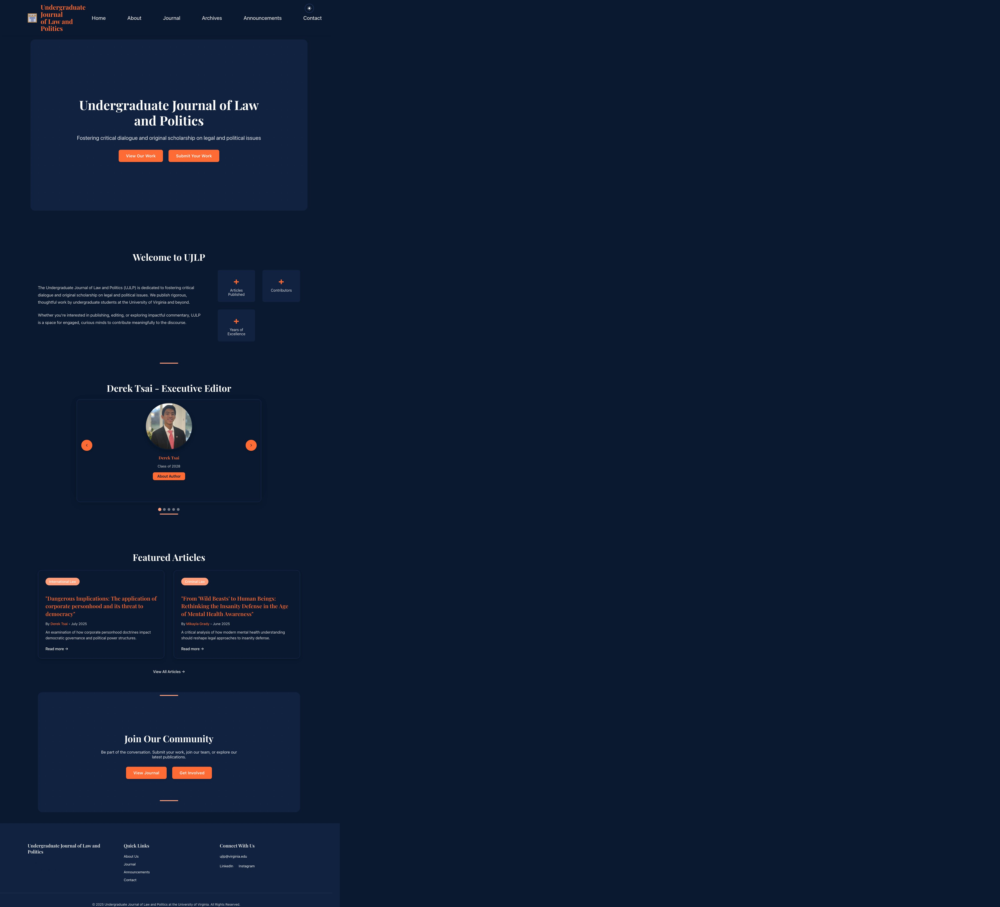

- Release date: 2025-07-19.
- Source anchor: `88eb78b2`.
- Scope since `v1.0.0`: 6 commits, 11 changed files, 1,452 insertions, 54 deletions.
- A detailed timeline update added fall 2025 events and cleaned up earlier timeline content.
- Rob's bio and coming-soon positions were added.
- Spacing and positioning were tuned for a cleaner release presentation.
- Representative commits: `97e37d45` Update timeline with correct dates and new fall 2025 events, `100f8e73` Added coming soon positions and made Rob's bio, `88eb78b2` Styling updates prepare for version 1.1.0.

### `v1.2.0` - More Bios And Motion

- Release date: 2025-08-02.
- Source anchor: `04dd0a4a`.
- Scope since `v1.1.0`: 9 commits, 7 changed files, 158 insertions, 74 deletions.
- Evan's page was added.
- Shelby's page was added near the end of the release window.
- Timeline and announcements were adjusted.
- The title pulse work suggests the site began picking up small animation and identity flourishes.
- Representative commits: `f792e8ef` Adjusted timelines and announcements, `a1561141` Added Evan's Page, `68a46396` Title pulse, `503fbc3a` Added shelby's page, `04dd0a4a` bug fix.

### `v1.3.0` - Richard And Refactoring

- Release date: 2025-08-03.
- Source anchor: `bbd857b7`.
- Scope since `v1.2.0`: 3 commits, 14 changed files, 251 insertions, 42 deletions.
- Richard was added.
- The site was refactored around the growing roster and author pages.
- The release also repaired accidental deletions from the prior work.
- Representative commits: `d29182d1` Fixed the deletions, `e4e93ba6` Updated with echols, `bbd857b7` Add richard and do some refactoring.

### `v1.3.1` - Patch Fix

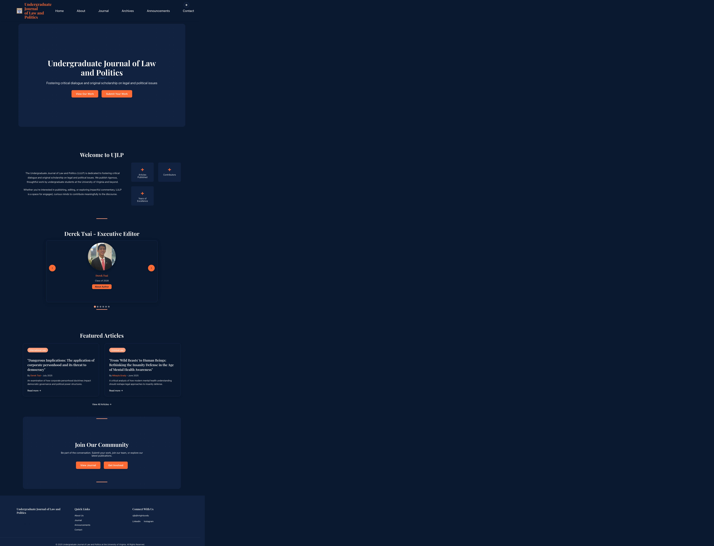

- Release date: 2025-08-03.
- Source anchor: `84cbb204`.
- Scope since `v1.3.0`: 1 commit, 1 changed file, 2 insertions, 3 deletions.
- A very small patch release followed `v1.3.0`.
- Representative commit: `84cbb204` Bug fix.

### `v1.4.0` - Additional Bios And Palette Reset

- Release date: 2025-08-06.
- Source anchor: `e6057b37`.
- Scope since `v1.3.1`: 2 commits, 11 changed files, 271 insertions, 91 deletions.
- Rishi, Will, and Mia bios were added.
- Styling fixes reverted the site toward a single-color treatment.
- This release continued the roster expansion and pushed the design toward more consistency.
- Representative commits: `84e150ca` Add rishi will and mia bios, `e6057b37` Styling bug fixes and reverted to single color.

### `v1.5.0` - Home Page, Logo, And PDF Direction

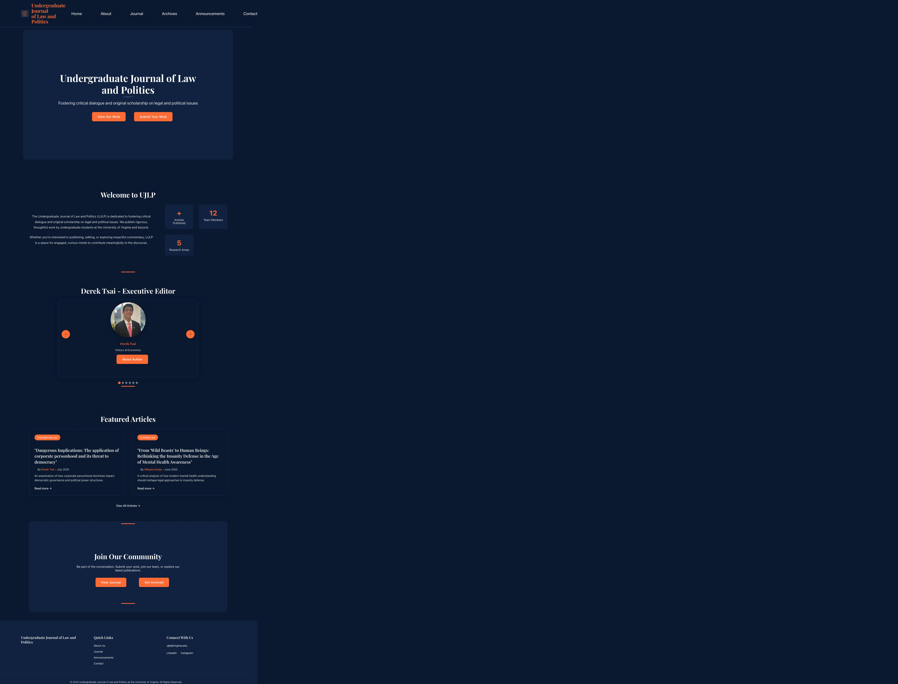

- Release date: 2025-08-17.
- Source anchor: `2922ea5f`.
- Scope since `v1.4.0`: 14 commits, 36 changed files, 480 insertions, 145 deletions.
- The home page was improved.
- Logo and favicon work entered the release stream.
- PDF mockups and PDF tuning appeared, pointing toward richer article presentation.
- Contact-page and button styling were refined.
- Representative commits: `2e3b5fbd` Better home page, `3308c729` Logo and stuff, `0751ad56` Favicon, `fac1c25b` Add pdf mockups, `df9697a7` Pdf tuning.

### `v1.5.5` - Join The Team And Charlie Base

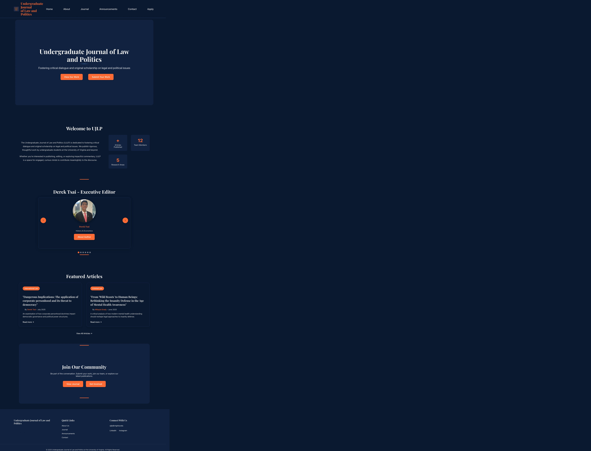

- Release date: 2025-08-23.
- Source anchor: `5fbed82d`.
- Scope since `v1.5.0`: 2 commits, 5 changed files, 192 insertions, 6 deletions.
- A new Join the Team page landed.
- Charlie's page received an initial base.
- Representative commits: `8c1fa9ac` Bug, `5fbed82d` New join the team page and made a base for charlies page.

### `v1.5.6` - Maintainability Refactor

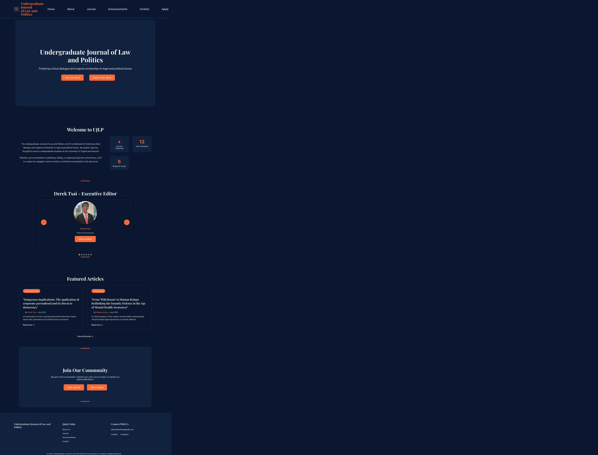

- Release date: 2025-08-24.
- Source anchor: `153ad673`.
- Scope since `v1.5.5`: 4 commits, 58 changed files, 89 insertions, 107 deletions.
- Derek's additional changes were brought in.
- Announcement bugs were fixed.
- Charlie's name was added.
- A broader maintainability refactor touched many files with low net code growth.
- Representative commits: `a3543053` Add Derek's other changes, `05c382ef` Bug fix for announcements, `fa695550` Add Charlie's name, `153ad673` Refactored my code for maintainability.

### `v1.6.0` - Header And Derek Collaboration Pass

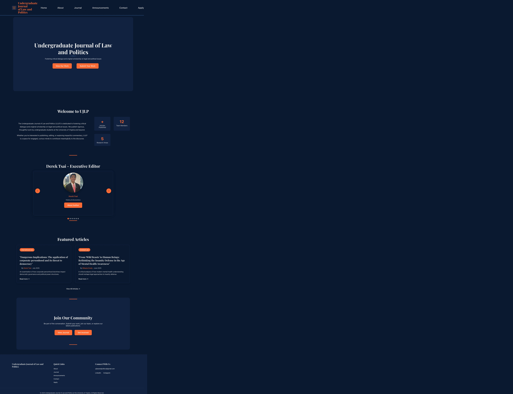

- Release date: 2025-09-01.
- Source anchor: `52189c62`.
- Scope since `v1.5.6`: 2 commits, 6 changed files, 10 insertions, 18 deletions.
- The line below the header was adjusted.
- Additional changes were made side-by-side with Derek.
- This was a narrow polish release rather than a feature expansion.
- Representative commits: `e8224a34` Adjusted size of line below header, `52189c62` Added some changes side by side with Derek.

### `v1.7.0` - Rhett, Logo, And Header Styling

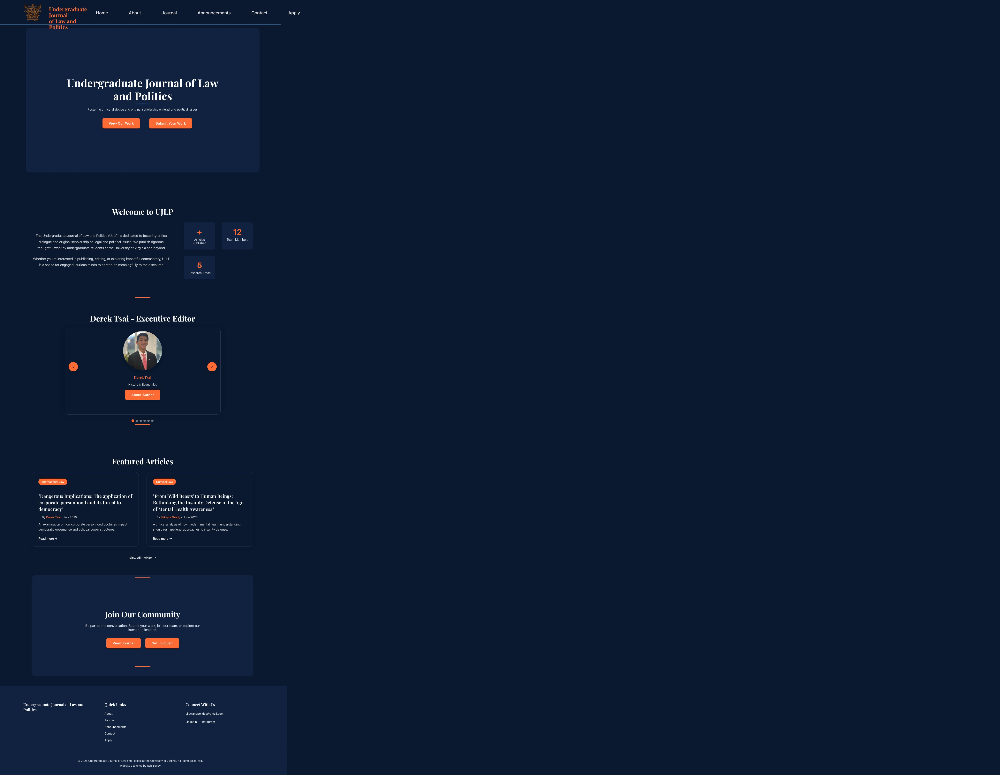

- Release date: 2025-09-06.
- Source anchor: `70b0e47f`.
- Scope since `v1.6.0`: 3 commits, 11 changed files, 118 insertions, 41 deletions.
- Rhett's page and bio were added.
- The logo was updated.
- Header styling was improved.
- Charlie and Rob bio bugs were fixed around the same release.
- Representative commits: `54f32cfb` Fix bug with Charlie's page; prepared for launch of Rhett's page and bio, `ffa7ff82` Bug Fixes for Rob's bio, `70b0e47f` Added in Rhett's page, new logo, and fixed the styling for the header to look better.

### `v1.7.5` - Profile Image Completion

- Release date: 2025-09-06.
- Source anchor: `73c9b352`.
- Scope since `v1.7.0`: 1 commit, 3 changed files, 91 insertions, 7 deletions.
- Profile images and coming-soon images were added for UJLP members.
- Representative commit: `73c9b352` Added profile images and coming soon images for all members of UJLP.

### `v1.7.6` - Team Photo Patch

- Release date: 2025-09-06.
- Source anchor: `8732424e`.
- Scope since `v1.7.5`: 2 commits, 1 changed file, 4 insertions, 4 deletions.
- Team member photo bugs were fixed.
- Representative commits: `6a99354c` Bug fix for the team member photos, `8732424e` Fixed it.

### `v1.8.0` - Search And Article Metadata Expansion

- Release date: 2026-01-11.
- Source anchor: `bca3c27e`.
- Scope since `v1.7.6`: 6 commits, 27 changed files, 1,203 insertions, 87 deletions.
- Additional bio pages were initialized to future-proof the roster.
- Mikayla was added and Charlie was removed at that historical point.
- The site later swapped Mikayla to Shelby and fixed local-hosting IP details.
- Derek's article summary and footer information were added.
- The major product feature in this release was search.
- Representative commits: `9dad6dc5` initialized a whole other batch of bio pages to future proof myself, `6329de5d` Added Mikayla and removed Charlie, `9aff8b62` Removed extra writers by commenting them out, swapped Mikayla to Shelby, and fixed the ip address for local hosting, `71046617` Added a summary for Dereks and a footer for his info, `bca3c27e` Added search bar.

### `v1.9.0` - Shelby Article Launch

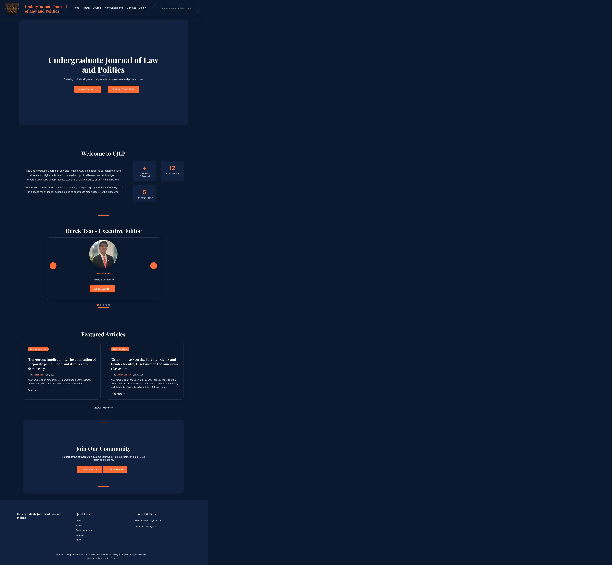

- Release date: 2026-01-15.
- Source anchor: `cb44232c`.
- Scope since `v1.8.0`: 5 commits, 13 changed files, 147 insertions, 75 deletions.
- Preparatory fixes landed for Shelby's article.
- Article pages moved toward opening PDFs through a button.
- "Schoolhouse Secrets" was added to search.
- Shelby's article was added and the home-screen link to Shelby's page was fixed.
- Representative commits: `edbe73ce` Lots of prepatory fixes for Shelby's Article, `db0dffcc` Style the pages to use a button to open the pdf, `f49b7aac` Add schoolhouse secrets to the search bar's capabilities, `194cb272` Add Shelby's Article, `cb44232c` Fix link to shelby's page on the home screen.

### `v2.0.0` - Feature Overhaul

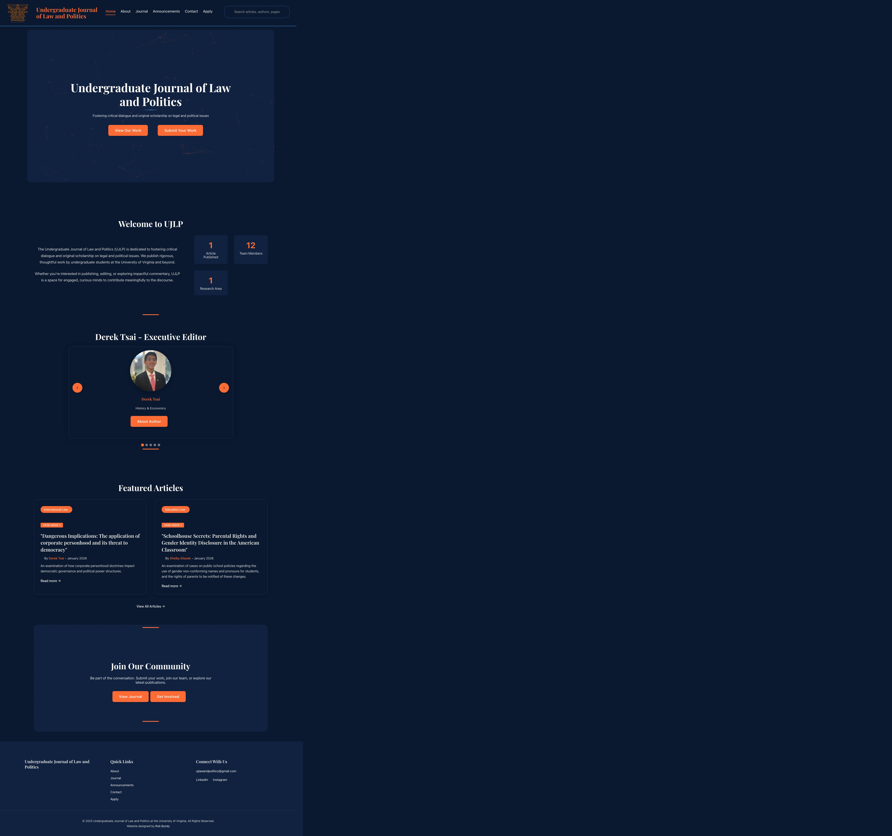

- Release date: 2026-01-17.
- Source anchor: `75fc2c5e`.
- Scope since `v1.9.0`: 4 commits, 31 changed files, 2,511 insertions, 87 deletions.
- This was the first major version jump after the 1.x release train.
- The release replaced or swapped several files and then landed a new features overhaul.
- Component and styling files were reorganized, with several CSS files moving into `Styling`.
- The result was a more componentized app with richer article, PDF, filter, particle, toast, typing, and back-to-top surfaces.
- Representative commits: `ba015add` swap files out, `1f7cab5c` Code Puppy changes, `0e0a5ed8` Add new features overhaul, `75fc2c5e` Add new features overhaul.

### `V2.1.0` - Root Restructure, Citation UX, And Profile Cleanup

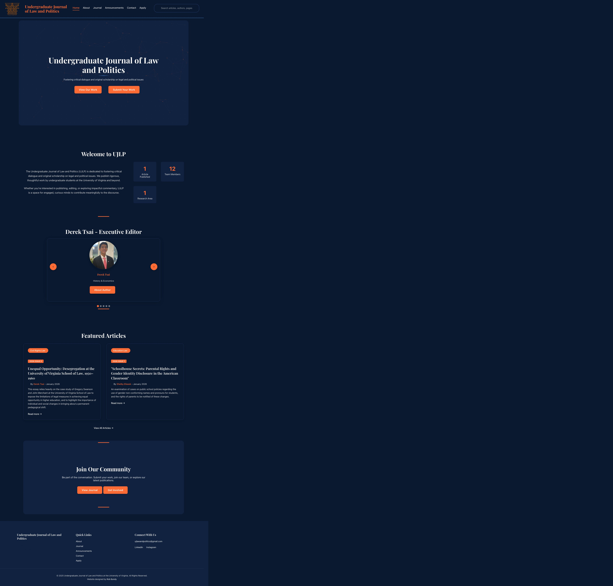

- Release date: 2026-05-08.
- Source anchor: `3fbda74f`.
- Scope since `v2.0.0`: 9 commits, 96 changed files, 370 insertions, 1,333 deletions.
- The project was restructured out of the `my-app` folder into the repository root.
- Large comment cleanup followed the restructure.
- Team content was adjusted in March and April.
- Citation UX landed with APA, MLA, and Chicago popovers, toast notifications, and reading-mode cleanup.
- Shelby's profile was cleaned up and updated.
- Representative commits: `74545efb` Restructuring out of my-app folder, `ec1b1340` Got rid of a lot of comments, `de9b264f` Add Cite popover (APA/MLA/Chicago), toast notifications; remove reading-mode components; UI styling updates, `3be57537` push dereks stuff, `3fbda74f` CLeanup and update Shelby's profile.

### `v3.0.0` - Editorial Redesign And Publication System

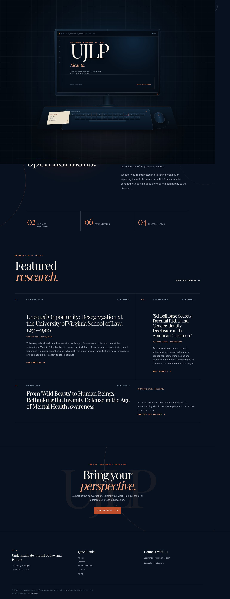

- Release date: 2026-07-24.
- Source anchor: `b8fd9706`.
- Scope since `V2.1.0`: 35 commits, 57 changed files, 4,065 insertions, 790 deletions.
- Article pages received sustained design work around author/editor cards, label placement, PDF header centering, and bio presentation.
- The alumni/card system was refined across a long series of May commits.
- A major July UI refresh reshaped the public-facing journal experience.
- Publication and about sections were updated.
- The journal UI was refreshed in multiple passes.
- Mobile cleanup and an intro typewriter effect were added.
- Preview build, routing, README overhaul, Derek article updates, and custom-domain preservation rounded out the release.
- Representative commits: `aa9cc576` Author/Editor cards: layout & styling; remove orange stripe; add editor for Derek, `b7faca79` Fix cards and bios, `97367842` UI Refresh, `b2a9c490` journal ui refresh, `3a17e6f7` mobile cleanup and awesome intro typewriter, `e04a2c9a` add components, `746d1608` Update Unequal Opportunity paper, `b8fd9706` Preserve UJLP custom domain.

## Current Main After `v3.0.0`

### Current `main` - September 2026

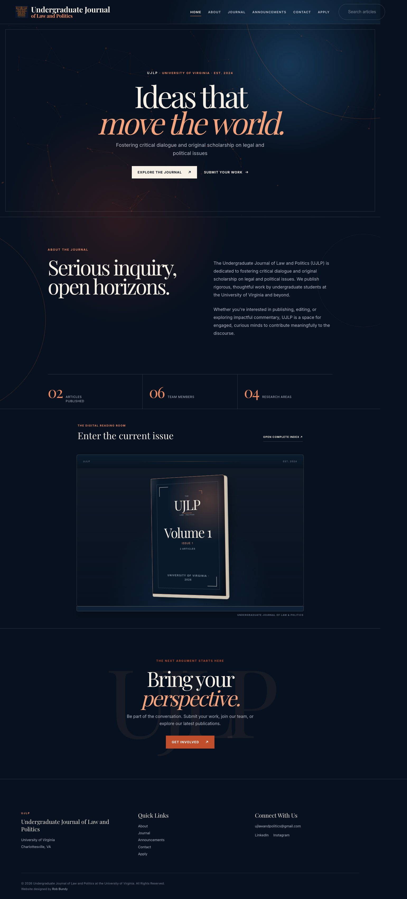

- Anchor: `383c3acf`, committed 2026-09-12.
- Scope since `v3.0.0`: 15 commits, 44 changed files, 1,836 insertions, 1,017 deletions.
- Derek article fixes landed in several July commits.
- CI/CD was reworked in August, including workflow tweaks and dependency updates from Dependabot.
- README screenshots were added and dependency artifacts were removed from tracking.
- Link fixes landed on 2026-08-27.
- The latest commit removes the Mikayla article/reference set and fixes the booklet cover hover effect.
- Representative commits: `78d51401` derek fixes, `752fad9b` CICD rework, `62895b71` Bump the npm_and_yarn group across 1 directory with 21 updates, `0302c026` chore: remove tracked dependency artifacts, `4d22cb02` fix links, `383c3acf` Remove Mikayla and fix css styling bug with booklet hover effect.

## Evolution Summary

- The site began as a very small Create React App with a narrow content column and basic navigation.
- By mid-2025, it had a recognizable journal identity, author bios, announcements, contact surfaces, and a dark card-based layout.
- The `v1.x` line was mostly about roster growth, profile imagery, article scaffolding, search, PDF entry points, and release polish.
- `v2.0.0` converted the project into a richer feature system with reusable components and stronger article tooling.
- `V2.1.0` moved the app out of `my-app`, cleaned up old structure, and introduced citation/toast interactions.
- `v3.0.0` was the biggest editorial redesign: publication surfaces, journal UI, article pages, mobile polish, and custom domain preservation.
- Current `main` continues that editorial direction with CI cleanup, link repairs, Derek article fixes, and the latest removal of the Mikayla/insanity-defense references.

## Screenshot Index

- [September 2024](changelog-assets/history-screenshots/monthly-2024-09.jpg)
- [October 2024](changelog-assets/history-screenshots/monthly-2024-10.jpg)
- [December 2024](changelog-assets/history-screenshots/monthly-2024-12.jpg)
- [January 2025](changelog-assets/history-screenshots/monthly-2025-01.jpg)
- [February 2025](changelog-assets/history-screenshots/monthly-2025-02.jpg)
- [April 2025](changelog-assets/history-screenshots/monthly-2025-04.jpg)
- [May 2025](changelog-assets/history-screenshots/monthly-2025-05.jpg)
- [June 2025](changelog-assets/history-screenshots/monthly-2025-06.jpg)
- [`v1.0.0`](changelog-assets/history-screenshots/release-v1-0-0.jpg)
- [`v1.1.0`](changelog-assets/history-screenshots/release-v1-1-0.jpg)
- [`v1.2.0`](changelog-assets/history-screenshots/release-v1-2-0.jpg)
- [`v1.3.0`](changelog-assets/history-screenshots/release-v1-3-0.jpg)
- [`v1.3.1`](changelog-assets/history-screenshots/release-v1-3-1.jpg)
- [`v1.4.0`](changelog-assets/history-screenshots/release-v1-4-0.jpg)
- [`v1.5.0`](changelog-assets/history-screenshots/release-v1-5-0.jpg)
- [`v1.5.5`](changelog-assets/history-screenshots/release-v1-5-5.jpg)
- [`v1.5.6`](changelog-assets/history-screenshots/release-v1-5-6.jpg)
- [`v1.6.0`](changelog-assets/history-screenshots/release-v1-6-0.jpg)
- [`v1.7.0`](changelog-assets/history-screenshots/release-v1-7-0.jpg)
- [`v1.7.5`](changelog-assets/history-screenshots/release-v1-7-5.jpg)
- [`v1.7.6`](changelog-assets/history-screenshots/release-v1-7-6.jpg)
- [`v1.8.0`](changelog-assets/history-screenshots/release-v1-8-0.jpg)
- [`v1.9.0`](changelog-assets/history-screenshots/release-v1-9-0.jpg)
- [`v2.0.0`](changelog-assets/history-screenshots/release-v2-0-0.jpg)
- [`V2.1.0`](changelog-assets/history-screenshots/release-v2-1-0.jpg)
- [`v3.0.0`](changelog-assets/history-screenshots/release-v3-0-0.jpg)
- [Current main](changelog-assets/history-screenshots/current-main-2026-09-12.jpg)
